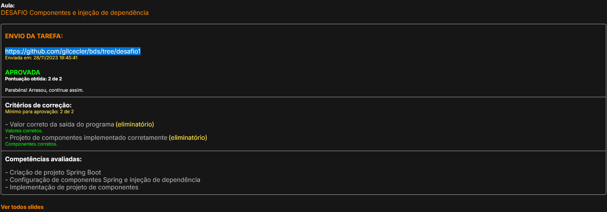

# DESAFIOS  Spring Profissional 

###  Módulo 1 Componentes e injeção de dependência

## ☕ Regras para o Desafio
(https://github.com/gilcecler/bds/blob/desafio1/desafio01.pdf)

###  Aprovação

## ☕ Módulo 2 DESAFIO Modelo de domínio e ORM
(https://github.com/gilcecler/bds/tree/orm-desafio)

## ☕ Módulo 3 DESAFIO CRUD de clientes API/Rest
(https://github.com/gilcecler/bds/tree/desafio-api-rest)

## ☕ Módulo 4 DESAFIO Consulta vendas Spring JPA
(https://github.com/gilcecler/desafio-consulta-vendas)

## ☕ Módulo 5 DESAFIO Projeto Spring Boot estruturado
(https://github.com/gilcecler/dscommerce)

## ☕  Spring Expert

## Testes automatizados no back end
    Pré-requisitos
    ●	Back end DSCatalog (capítulo 1) 
    Competências
      ●	Fundamentos de testes automatizados
      ○	Tipos de testes
      ○	Benefícios
      ○	TDD - Test Driven Development
      ○	Boas práticas e padrões
      ●	JUnit
      ○	Básico (vanilla)
      ○	Spring Boot
      ■	Repositories
      ■	Services
      ■	Resources (web)
      ■	Integração
      ●	Mockito & MockBean
      ○	@Mock
      ○	@InjectMocks
      ○	Mockito.when / thenReturn / doNothing / doThrow
      ○	ArgumentMatchers
      ○	Mockito.verify
      ○	@MockBean
      ○	@MockMvc
    Etapas
    ●	Fundamentos + JUnit vanilla (exercício de fixação)
    ●	Testes de repository (exercício de fixação)
    ●	Testes de unidade com Mockito (exercício de fixação)
    ●	Testes da camada web com MockMvc (exercício de fixação)
    ●	Testes de integração
    ●	Desafio TDD (desafio final para entregar)
  

## ☕Testes junit sem o spring boot
https://github.com/gilcecler/teste-junit-vanilla

## ☕ Projeto resultado das aulas e
# exercícios do módulo 02 - testes 
https://github.com/gilcecler/dscatalog-testes

## ☕ Aula e exercicio TDD
https://github.com/gilcecler/tdd-employee/tree/main

## ☕ Módulo 2 DESAFIO TDD 
(https://github.com/gilcecler/desafio-tdd-bds)

## ☕ Módulo 3 Validação e Segurança
(https://github.com/gilcecler/dscatalog-cap3-desafio-seg-valid-entrega/tree/main)
